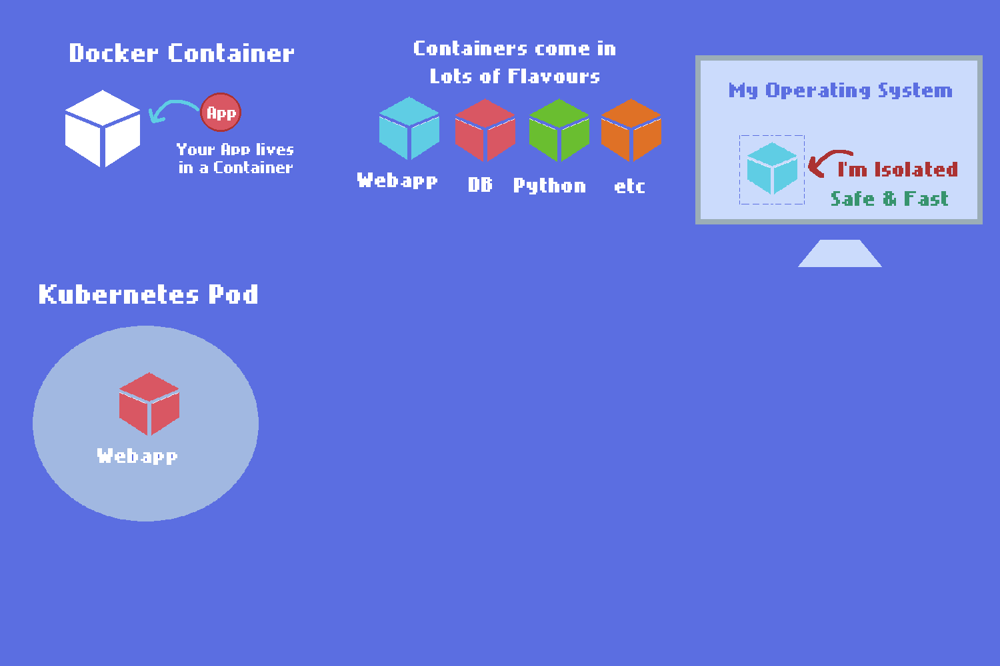

# K8 in a Nutshell 
     
    
  


# Navigation
  
1. [Introduction](#Introduction)
2. [Start up minikube](chapters/minikube/README.md)   
3. [Deployments](chapters/deployments/README.md)
4. [External Services & Ingress](chapters/ingress/README.md)
5. [Useful Commands & Debugging](chapters/debug/README.md)
8. [Helm](#Helm)
9. [Theory](chapters/theory/README.md)

[ [My Project Review](#d) ]  [ [Nana Project Review](chapters/nana/README.md) ] 
  
https://github.com/murchie85/k8/blob/master/README.md
    

## Super Super Super Simplified  Introduction

**VM** `is a virtual machine, (think of it like another computer in your computer, with its own Operating System OS). Example is you could run a Mac OS on your Windows OS`        

**Docker** `is a strip down VM, lightweight, you run a single app in it only, its easy to ship and solves machine compatibility issues (like an app that runs on Mac but not Windows).`   

**Kubernetes** `Bundles lots of Docker containers, manages them so you can have a full infrastructure roll out at a click of a button.`         

    

*i'm working on this image, its not finished yet*  

  
**WHY THO?** Docker containers are small, fast and are little isolated bubbles on your computer, so you can build a full app there without messing up your computer system. Building docker containers one at a time can be tedius, and you may want to orchastrate a bunch of them, such as one for your app, another for your database, another for the website front end etc. That's where Kubernetes comes in.  
  
Kubernetes manages these containers, but has its own terminology, more basics can be found [here](https://kubernetes.io/docs/tutorials/kubernetes-basics/)  

    
### Introduction  

Kubernetes is a container orchastration tool that is extemely popular in development, devops and infrastructure. It can be complicated to learn as it is built upon the concepts of containerisation (docker), Containers can be thought of as a strip down vm, lightweight and designed to run a single app only. Kubernetes is meant to manage multiple containers at scale. 
  
In short kubernetes lets you deploy a full end to end digital service, such as a database, front end and back end all in the one ecosystem. It allows for scaling accross multiple machines on prem or on the cloud and lets you manage routing such as ingress and namespaces.   
  
These notes are not designed as a tutorial, rather go to notes from resources including Nana's youtube, Kubernetes documentation and blogs.   
  


### High Level Steps
      
1. Start your Kubernetes Cluster such as Minikube 
2. Deploy secrets,configmap etc that needs to be in place before cluster is set up 
3. Deploy configuration files
4. Test and validate
    
## Building out your own project   
  

- Decide what you want to build
- Plan it out carefully
	- Will you need Networking?
	- Will you need persistent storage?
- Read docker requirements for the images you use
- create config files
- spin up your cluster  


## Example Commands for Spinning up a Quick Cluster

```sh
minikube start --vm-driver=hyperkit     # starts minikube

kubectl create deployment my-depl --image=nginx 
OR
kubectl apply -f [config.yaml]          # applies config 

kubectl edit deployment my-depl         # edits active deployment
  
kubectl exec -it[pod name] -- bin/bash  # jumps into pod
  
kubectl delete deployment nginx-depl    # deletes 

```
    
  
# Navigation
  
1. [Introduction](#Introduction)
2. [Start up minikube](chapters/minikube/README.md)   
3. [Deployments](chapters/deployments/README.md)
4. [External Services & Ingress](chapters/ingress/README.md)
5. [Useful Commands & Debugging](chapters/debug/README.md)
8. [Helm](#Helm)
9. [Theory](chapters/theory/README.md)


 