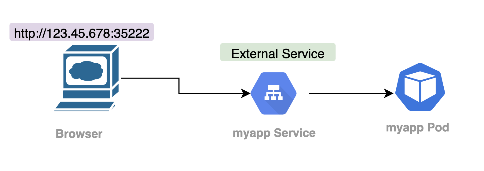
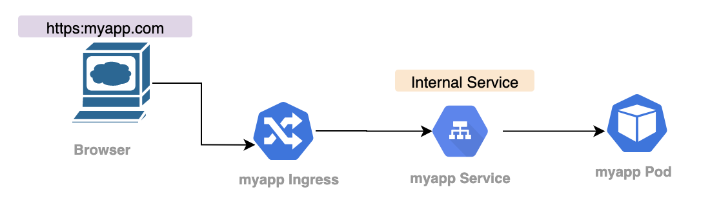
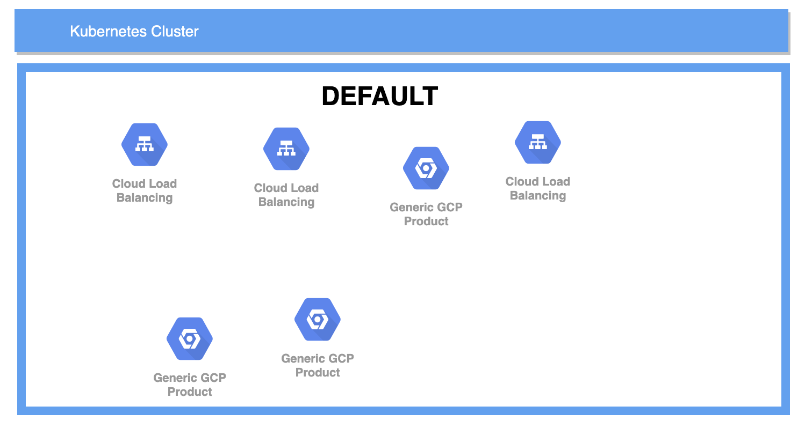
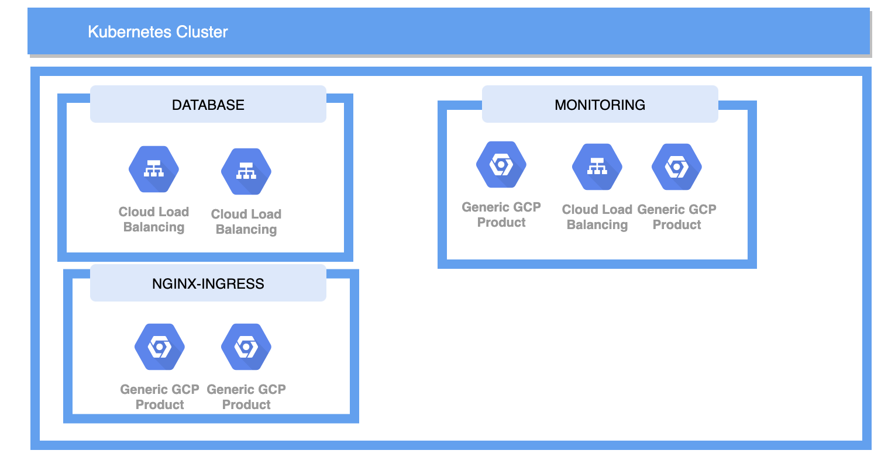

# K8 in a Nutshell 
    

  
    


# Navigation
  
1. [High Level Steps](#High-Level-Steps)
2. [Start up minikube](chapters/minikube/README.md)   
3. [Deployments](chapters/deployments/README.md)
3. [Creating Deployment From Image](#Creating-Deployment-From-Image) 
    - [Edit Deployment Image](#Edit-Deployment-Image)
4. [Create Deployment from Configuration File](#Create-Deployment-from-Configuration-File) 
    - [Secrets](#Secrets)
    - [CONFIG MAP](#CONFIG-MAP)
    - [Creating your config file](#Creating-your-config-file)
    - [SSH into pod](#SSH-into-pod)  
5. [Ingress](#Ingress)
    - [External Service](#External-Service) 
    - [Default Backend](#Default-Backend)
    - [Ingress Usecases](#Ingress-Usecases)
6. [Useful Stuff](#Useful-Stuff)
7. [Debug Commands](#Debug-Commands) 
8. [Helm](#Helm)
9. [SoloProject](#d)
10. [Nana Project Review](#Nana-Project-Review)   
99. [Theory](#Theory)  
    - [Sample Config File](#Sample-Config-File)
    - [NameSpace](#NameSpace)  

  
  

  
  
### Introduction  
  
Kubernetes is a container orchastration tool that is extemely popular in development, devops and infrastructure. It can be complicated to learn as it is built upon the concepts of containerisation (docker), Containers can be thought of as a strip down vm, lightweight and designed to run a single app only. Kubernetes is meant to manage multiple containers at scale. 
  
In short kubernetes lets you deploy a full end to end digital service, such as a database, front end and back end all in the one ecosystem. It allows for scaling accross multiple machines on prem or on the cloud and lets you manage routing such as ingress and namespaces.   
  
These notes are not designed as a tutorial, rather go to notes from resources including Nana's youtube, Kubernetes documentation and blogs.   
  


### High Level Steps
      
1. Start Minikube 
2. Deploy secrets,configmap with kubectl 
3. Deploy config
  
- Decide what you want to build
- Read docker requirements for the images you use
- create config files
- spin up   


```sh
minikube start --vm-driver=hyperkit     # starts minikube

kubectl create deployment my-depl --image=nginx 
OR
kubectl apply -f [config.yaml]          # applies config 

kubectl edit deployment my-depl         # edits active deployment
  
kubectl exec -it[pod name] -- bin/bash  # jumps into pod
  
kubectl delete deployment nginx-depl    # deletes 

```
    
  
  
## Start up minikube
  
 
```
minikube start --vm-driver=hyperkit
```  

### Check minikube status  
  
```sh
minikube status  
``` 
  

**EVERYTHING IS KUBECTL** from here on. *minikube is just for starting the cluster*    

  
  


### Check available nodes

```sh
kubectl get nodes  # Checks for nodes like other machines 
```
      

### Get kubectl version  
     
```sh
kubectl version   # If we see client and server version it's all working ok
```
- Note the client ver 
- note the server ver   

```sh
Client Version: version.Info{Major:"1", Minor:"15", GitVersion:"v1.15.5", GitCommit:"20c265fef0741dd71a66480e35bd69f18351daea", GitTreeState:"clean", BuildDate:"2019-10-15T19:16:51Z", GoVersion:"go1.12.10", Compiler:"gc", Platform:"darwin/amd64"}

Server Version: version.Info{Major:"1", Minor:"20", GitVersion:"v1.20.0", GitCommit:"af46c47ce925f4c4ad5cc8d1fca46c7b77d13b38", GitTreeState:"clean", BuildDate:"2020-12-08T17:51:19Z", GoVersion:"go1.15.5", Compiler:"gc", Platform:"linux/amd64"}
```
  
  
## get services   
  
```
kubectl get services  
kubectl get all // better
```    
  


  

  
# Creating Deployment From Image
    

[Navigation](#Navigation)  
  

- We don't create pods
- We create the layer above i.e. deployments 
  
  
```sh

# Create a new deployment named nginx-depl that uses nginx image from docker
kubectl create deployment nginx-depl --image=nginx 
```    

- Creates a pod
- Creates a replicaset
- creates a deployment
    

**Ways to Check**  
  

```
kubectl get pod
kubectl get depoloyment
kubectl get replicaset
```  
    
    

## Edit Deployment Image

[Navigation](#Navigation)  
 
  
(You only ever need to edit stuff via deployment)  
  
```

kubectl edit deployment nginx-depl 

```
  
- most stuff is auto generated default   
- because how we set it.  
    
- we make a change to ver   

```yaml
    spec:
      containers:
      - image: nginx:1.16
```  
- do a get all to see that it gets deleted and a new pod gets created.  
  
  

    
  


# Create Deployment from Configuration File
   

[Navigation](#Navigation)  
   

consider the folowing:  
  
`kubectl create deployment name image option1 option2` 
  
- Using config file is much easier.  
  
### Method  
  
```
kubectl apply -f [file_name] 
```    
  

## Secrets  
  

[Navigation](#Navigation)  
      
  
    
** MUST BE CREATED BEFORE DEPLOYMENT **  
  
  
- In spec you may have env name/value pairs
- Create a `secrets.yaml` file  

```yaml
apiVersion: v1
kind: Secret
metadata:
  name: mongodb-secret
type: Opaque
data:
    mongo-root-username:
    mongo-root-password:

```
  
- to generate base 64 encoded.  

```
echo -n 'username' | base64    
```

Reference the secret with the following in the `env` section using `valueFrom` and `secretKeyRef`:  
  
** NAME MUST BE THE ENV VAR SPECIFIED IN THE DOCUMENTATION**  

```yaml
        - name: MONGO_INITDB_ROOT_USERNAME
          valueFrom:
            secretKeyRef:
              name: mongodb-secret
              key: mongo-root-username
```  
  


Once populated appropriately apply: 
  
``` 
kubectl apply -f secrets.yaml  
```   
  
Then to get the secret run:  
  
```
kubectl get secret  
```  
  

## CONFIG MAP
  
- Centralises referneces 
- saves updating multiple configs  
  

```yaml
apiVersion: v1
kind: ConfigMap
metadata:
  name: mongodb-configmap
data:
  database_url: mongodb-service
```
    
- Apply  

```
kubectl apply -f mongo-configmap.yaml
```
  
   
### Creating your config file
  

[Navigation](#Navigation)  
      


1. Create a yaml file  
```
touch nginx-deployment.yaml 
```
2. Edit it like the following 

```yaml
apiVersion: apps/v1
kind: Deployment
metadata:
  name: nginx-deployment
  labels:
    app: nginx
spec:
  replicas: 1
  selector:
    matchLabels:
      app: nginx
  template:
    metadata:
      labels:
        app: nginx
    spec:
      containers:
      - name: nginx
        image: nginx:1.16
        ports:
        - containerPort: 8080
```
  
3. Apply  
  
``` 
kubectl apply -f nginx-deployment.yaml  
```  
 
4. Make changes  
  
- edit yaml file 
 
```yaml
replicas: 2
```  
 
- apply again  
  
```
kubectl apply -f nginx-deployment.yaml  
   
```  
  
5. Make service file   

```
touch nginx-service.yaml
```
  
```yaml
apiVersion: v1
kind: Service
metadata:
  name: nginx-service
spec:
  selector:
    app: nginx
  ports:
    - protocol: TCP
      port: 80 ------------------> exposed port
      targetPort: 8080 ----------> container port

```
  
Targetport **should match** the containerport
  

```
kubectl apply -f nginx-service.yaml
   
```    
    
**Validate** it is listening on the right ports etc  
  
```
kubectl describe service nginx-service.yaml  
```  
     
Check the **pods match up**  
    
```
kubectl get pod -o wide
```  
  
Check current **status**  
  
```
kubectl get deployment nginx-deployment -o yaml 
```

## SSH into pod

```
kubectl exec -it[pod name] -- bin/bash
```
  
## Delete Deployment  
  
```
kubectl delete deployment [depl-name]
```  
  
- This will delete replicaset, pod, service   
- Test with `kubectl get all`  
      


# External Service  
      

[Navigation](#Navigation)  
          
  
  
*note the flow*  

Setting an external service makes the pod accessible via port/url, this is good for quick test. For secure production you need to follow the [ingress](#Ingress) approach. 

- Defined as `type: loadBalancer` in service configuration  
- Required a `nodePort` to be defined  
- This is the port you put in the browser to access it 
- It has a range from (30000 to 32767)  

## Example External Service  

```yaml
---
apiVersion: v1
kind: Service
metadata:
  name: mongo-express-service
spec:
  selector:
    app: mongo-express
  type: LoadBalancer  
  ports:
    - protocol: TCP
      port: 8081
      targetPort: 8081
      nodePort: 30000  ---> entry 
```
  
Note when we run `kubectl get service` we have our loadbalancer with two IPs (internal/external)
  

```sh 
NAME                    TYPE           CLUSTER-IP    EXTERNAL-IP   PORT(S)          AGE
mongo-express-service   LoadBalancer   10.110.77.9   <pending>     8081:30000/TCP   10m
mongodb-service         ClusterIP      10.97.33.92   <none>        27017/TCP        62m
```


**Accesing your service** 
  
```
minikube service your-service-name
```  
    


## Ingress    
    
1. Create your ingress yaml
2. tie it up to internal service
3. create an `ingress implementation` which is an `ingress controller`  
4. Need to set up entry point, which varies based on cloud, bare metal etc. 
5. Create an ingress rule.  
  

    

*compare the flow with external service above* 
  

External Service looks like `user via browser --> service SVC balancer --> pod` .  
The URL will look like:  

`http://123.45.678:35222`  
  
Using Ingress will look like `browser --> ingress controller --> myapp-ingress --> internal service --> pod` 
The URL will look like:  

`https://my-lovely-app.com`  
  

## Example Ingress with http

```yaml  
apiVersion: networking.k8.io/v1beta1  
kind: ingress 
metadata:  
  name: myapp-ingress  
spec:  
  rules:  
  - host: myapp.com  
    http:
      paths:
      - backend:
          servicename: my-app-internal-service --------> maps to serice name
          serviceport: 8080    ------------------------> maps to service port
---  
apiversion: v1
kind: Service
metadata: 
  name: myapp-internal-service
spec:
  selector:
    app: myapp
  ports:
    - protocol:TCP
      port: 8080
      targetPort: 80 

```  
*bottom is internal service for comparison*  


- we define `kind: ingress`
- we define **rules** for routing.  
  - So the host `myapp.com` must be forwarded to an internal service `my-app-internal-service`   
  - path: is what comes after the url part i.e. `http://myapp.com/blah`    
  - http **does not** refer to the `http://myapp.com` , it's actually the second step reouting to internal service   
  - note service doesn't have :
    - node port
    - no load balancer on internal service  

**Important**  
  
- Must be `valid ip address`  
- You must map the domain name to `Node's entry ip address` which is the `entry point`  i.e. the hosting node.  
    
## Ingress controller  

Creating the yaml isn't enough, you need to create `ingress implementation` which is an `ingress controller`
  
- Evaluates all the rules
- Manages redirection
- Entrypont to cluster 
- Many 3rd party impmentations i.e. k8s Nginx Ingress controller 
    
**Entry point must be setup** be it external hardware, software, cloud etc.   
  
External request load balancing happens prior to entry point.
The ingress controller decides what to pass on to ingress service.  
  
### Ingress controller on minikube example  
  
`minikube addons enable ingress`

Automatically starts the k8s Nginx ingress controller. 

If we `kubectl get pod -n kube-system` we will see it added   
  
### Create ingress rule 

Let's create a ingress rule for our cluster (demo shows as dashboard app: will need to create my own)   
  
Set up yaml as shown above [sample](Example-Ingress-with-http)  
  
once executed with `kubectl apply -f ingress.yaml`  we wait for address to be populated:  
  
`kubectl get ingress -n [namespace] --watch` (will watch it)  
  
`sudo /etc/hosts` update the ip address accordingly.  
 
i.e  
 
```sh
##
# Host Database
#
# localhost is used to configure the loopback interface
# when the system is booting.  Do not change this entry.
##
127.0.0.1 localhost
255.255.255.255 broadcasthost
192.123.45.6    myapp.com   
 
```    
    
Ingress pod will now forward this rule to the ingress service.  
  
## Default Backend
`kubectl describe ingress myapp-ingress -n [namespace]`  
  
Note the `default-http-backend:80 (<none>)`  this is used if there is no rule/root to map to backend service.  
It's good for handling custom error messages.   
   

To set this up you need: 

- create internal service with same name `default-http-backend`  
- Port no

  
## Ingress Usecases
  
### Multiple paths for same host
  
```yaml  
apiVersion: networking.k8.io/v1beta1  
kind: ingress 
metadata:  
  name: simple-fanout-example 
  annotations: 
    nginx.ingress.kubernetes.io/rewrite-arget: /
spec:  
  rules:  
  - host: myapp.com  
    http:
      paths:
      - path: /analytics
        backend:
          servicename: analytics-service
          serviceport: 3000
      - path: /shopping
        backend:
          servicename: shopping-service
          serviceport: 8080    
```  
  
This gives two paths for two urls:  
`myapp.com/analytics-service`   -> analytics service -> analytics pod
and  
`myapp.com/shopping-service`    -> shopping service -> shopping pod  
  
### Multiple subdomains  
  

Instead of `http://myapp.com/analytics` we get `http://analytics.myapp.com`
  
I.e. analytics bit comes first.  
    
Instead of having one host and multiple paths, we have multiple hosts with one path.  
Each represents a subdomain.  
  

```yaml  
apiVersion: networking.k8.io/v1beta1  
kind: ingress 
metadata:  
  name: simple-fanout-example 
  annotations: 
    nginx.ingress.kubernetes.io/rewrite-arget: /
spec:  
  rules:  
  - host: analytics.myapp.com  
    http:
      paths:
        backend:
          servicename: analytics-service
          serviceport: 3000
  - host: shopping.myapp.com  
    http:
      paths:
        backend:
          servicename: shopping-service
          serviceport: 8080  
```    
  
## Configuring TLS Certificate  
  
It's easy to configure https forwarding in ingress.    
Ensure you have the TLS certificate saved in the cluster as a secret.  
  
  
Just define the following above rules section under the spec.  

```yaml
  tls:
  - hosts:
    - myapp.com 
    secretName: myapp-secret-tls  
```
  
The secrets look like the following
  

```yaml
apiVersion: v1
kind: secret
metadata:
  name: myapp-secret-tls
  amespace: default
data:
  tls.crt: base64 encoded cert 
  tls.key: base64 encoded key
type: kubernetes.io/tls
```  
  
- Just base64 the value.
- data needs to be `tls.crt` and `tls.key`    
- Values have to be the file contents, not the path  
  
Remember to keep secret in the same namespace.   


  


# Useful Stuff
    
[Navigation](#Navigation)  
  
- Don't need to modity replicasets   
- Secrets need to be applied before cluster spins up. 
    
## Useful KUBECTL Commands    

```sh
kubectl get all    // get everything
  

kubectl delete deployment nginx-depl
```
## Useful MINIKUBE commands    

  
```
minikube start
minikube status
minkube stop
minikube delete
minikube dashboard
minkube puase
minikube unpause
```
  

## Create example usage    
```sh 
kubectl create -h  
  
### example usage  
Usage:
  kubectl create deployment NAME --image=image [--dry-run] [options]
```  
      
In the options we can specify more than one replica set.  
     

  
## Debug Commands

[Navigation](#Navigation)  
      

- SSH into pod
- Get Logs 
- Describe pods
- Describe service
- More pod info  
- Get active deployment info 

  
```
kubectl exec -it[pod name] -- bin/bash 
```  

    
```
kubectl logs [podname]
```    
  
```  
kubectl describe pod [podname]  
```
- output  
  
```
  Type    Reason     Age    From               Message
  ----    ------     ----   ----               -------
  Normal  Scheduled  4m25s  default-scheduler  Successfully assigned default/nginx-depl-7fc44fc5d4-ncwkx to minikube
  Normal  Pulling    4m25s  kubelet, minikube  Pulling image "nginx:1.16"
  Normal  Pulled     4m23s  kubelet, minikube  Successfully pulled image "nginx:1.16" in 1.435142631s
  Normal  Created    4m23s  kubelet, minikube  Created container nginx
  Normal  Started    4m23s  kubelet, minikube  Started container nginx
  ```


## Validate it is listening on the right ports etc  
  
```
kubectl describe service nginx-service.yaml  
```  
   
### Check the pods match up  
  
```
kubectl get pod -o wide
```  
  
## Get active deployment info  
  
```
kubectl get deployment nginx-deployment -o yaml
```


# Helm  
  

Package Manager for Kubernetes, like `apt/yum/homebrew` for kubernetes.   
  
To package collection of YAML files and distribute to public registry.  
  
For Elastic Stack for logging you would need:  
  
- Stateful set  
- config map 
- K8s User with permissions  
- Secret  
- Services


 


  
# Theory  
  
  


[Navigation](#Navigation)  
      
  


  **DEPLOYMENT** manages a 
    
  
  **REPLICASET** manages a 
  
    
  **POD** manages a  
    
  **container**  
 

## Config file  
 
- Has Three parts  
  - Metadata
  - spec 
  - status  (auto generated/updated)   
  
## Sample Config File
  

- note the `---` is just seperation .  

```yaml
apiVersion: apps/v1
kind: Deployment
metadata: ---------------------> for 
  name: mongo-express
  labels:
    app: mongo-express
spec:  -------------------------> for 
  replicas: 1
  selector:
    matchLabels:
      app: mongo-express
  template:
    metadata: --------------------> for pods
      labels:
        app: mongo-express
    spec: ------------------------> for pods
      containers:
      - name: mongo-express
        image: mongo-express
        ports:
        - containerPort: 8081
        env:
        - name: ME_CONFIG_MONGODB_ADMINUSERNAME
          valueFrom: ------------------------> from secrets file
            secretKeyRef:
              name: mongodb-secret
              key: mongo-root-username
        - name: ME_CONFIG_MONGODB_ADMINPASSWORD
          valueFrom: 
            secretKeyRef:
              name: mongodb-secret
              key: mongo-root-password
        - name: ME_CONFIG_MONGODB_SERVER
          valueFrom: ------------------------> from config map
            configMapKeyRef:
              name: mongodb-configmap
              key: database_url
---
apiVersion: v1 ------------------------> service in same file 
kind: Service
metadata:
  name: mongo-express-service
spec:
  selector:
    app: mongo-express  ------------------------> Connects to pods of same name
  type: LoadBalancer  
  ports:
    - protocol: TCP
      port: 8081
      targetPort: 8081
      nodePort: 30000

```  

**LABELS** and **SELECTORS**  
 
- Metadata have labels  
- Spec has selectors
  
  
- Metadata at the top applies to the **service**  
- Metadata in the template applies to the **pod**  


**Status** is polled from ETCd,  
  
**Format** is YAML, strict about indendations.  
  
Use Yaml validator online.  
  
**Store** yaml files with your code.  
  
**Template** part has its own metadata and spec part, it applies to pods.

**Template** is the blueprint for your pod.  
  
    

## NameSpace  
    
  
*All objects reside in the default namespace unless otherwise set*  

Name spaces are logical partitions within a cluster, if you don't create any all resources go into `default` name space. 


Four kinds of namespaces  

- kube-system `system info` 
- kube-public `kubectl clusterinfo` 
- kube-node-lease `heartbeat` 
- default  `this is where our stuff goes if we haven't created a namespace`     
  
### Use Cases  
  

  
* each name space in this case represents a function partition*      

- Group by function (Db, Monitoring etc)
- IAM restrict teams to a namespacs
  - limit resources quotas per namespace
- Group by teams (teamA,TeamB) 
    - prevents conflict and overwriting
- BlueGreen Deployment that needs to share resources   
    
## Create  
  

`kubectl create namespace [my namespace]`    
    

    
or apply namespace config file  
  
```yaml
apiVersion: v1
kind: configMap
metadata:
  name: my-app-configmap
  namespace: my-assigned-namespace
data:
  db_url: mysql_service.database  

```  
   
```
kubectl apply -f myconfigmap.yaml
```
    
**Important**  
  
If you try to get your config map, it wont work `kubectl get configmap` because it defaults to default namespace.  
  
run:  
  
`kubectl get configmap -n [target-namespace]`
  
- This has to be applied for all commands and config files  .  
    
## Kubens  
  
Allows you to switch namespace:  
  
`brew install kubectx`  
    
### List namespace   
  
kubens  

### Switch and create namespace  
  
`kubens my-namespace`  
  


## Notes  
  
- Each namespace must define its own config map, secrets 
- Service can be accessed outside of a namespace using the following convention   
  
```yaml
data:
  db_url: mysql_service.other_namespace  
```  
   
The end affix `other_namespace` is the name of the namespace you are trying to get into .  
  
- Some components are global you can see them by running `kubectl api-resources --namespaced=false` 
  - Vol
  - Node 
  
List all namespace resources  
  
`kubectl api-resources --namespaced=true`    
  
  


# Nana Project Review
  
  

[Navigation](#Navigation)  
      
  

This is a recreation of the project created by Nana [here](https://www.youtube.com/watch?v=X48VuDVv0do&t=5057s&ab_channel=TechWorldwithNana)  
    
`MongoDB` backend database 
`MongoExpress` Front end interactive tool  

It is two main config files, one for mongoDB backend with no external access and another for mongo-express which communicates with backend. There is a secrets file and also a configmap which provides a `database_url`.  
  
## Summary  

```md
MONGODB DEPLOYMENT
Container Port: 27017    
  
MONGO EXPRESS
containerPort: 8081  
nodePort: 30000 

---All Values obtained from Dockerhub documentation
```  
  

# Steps  
  
**KEY** Always view the docker image documentation on how to set up env variables.   

1. Set up **secrets file**, use echo to base64 to populate. 
    - Modify mongo-deployment file with username and password key  
    - `kubectl apply -f secrets.yaml`  
    - `kubectl get secret`  
   Set up **configmap file**. 
    - Modify mongoexpress file with details
    - `kubectl apply -f mongo-configmap.yaml`  
    - `kubectl get configmap`   

2. Setup **mongodb.yaml** deployment   
    - From documentation it needs to know: 
    - Which creds to authenticate `MONGO_INITDB_ROOT_USERNAME` and `MONGO_INITDB_ROOT_PASSWORD` 
    - `kubectl apply -f mongodb.yaml`    

**Validation**
    - Validate: `kubectl get all | grep mongodb`  
    - Validate Service: `kubectl describe service mongodb-service`
    - Validate IP matches Pod IP `kubectl get pod -o wide`   

3. Setup **Mongoexpress** service  
    - From documentation it needs to know: 
    - Which Database to connect to: `ME_CONFIG_MONGODB_SERVER`
    - Which creds to authenticate `ME_CONFIG_MONGODB_ADMINUSERNAME` and `ME_CONFIG_MONGODB_ADMINPASSWORD`

    - Create express service 
      - Add type: `loadBalancer` 
  
    - `kubectl apply -f mongo-express.yaml` 
    - Note your service isn't default `clusterIP` its `loadBalancer`  
    - `kubectl logs mongo-express-pod`  check for listening and `db connected`  
    - `minikube service mongo-expresss-service` to go ahead and connect.  


**Now it should Run**  
    

## FLOW  
   
- When you test by adding a database:  

`browser` --> `mongo-express external service` --> `mongoDB internal service` --> `mongoDB pod`
 
  


## Config Files
  
### secrets.yaml
```yaml
apiVersion: v1
kind: Secret
metadata:
    name: mongodb-secret
type: Opaque
data:
    mongo-root-username: dXNlcm5hbWU=
    mongo-root-password: cGFzc3dvcmQ=

``` 
 
### mongodb.yaml  

```yaml 
apiVersion: apps/v1
kind: Deployment
metadata:
  name: mongodb-deployment
  labels:
    app: mongodb
spec:
  replicas: 1
  selector:
    matchLabels:
      app: mongodb
  template:
    metadata:
      labels:
        app: mongodb
    spec:
      containers:
      - name: mongodb
        image: mongo
        ports:
        - containerPort: 27017
        env:
        - name: MONGO_INITDB_ROOT_USERNAME
          valueFrom:
            secretKeyRef:
              name: mongodb-secret
              key: mongo-root-username
        - name: MONGO_INITDB_ROOT_PASSWORD
          valueFrom: 
            secretKeyRef:
              name: mongodb-secret
              key: mongo-root-password
---
apiVersion: v1
kind: Service
metadata:
  name: mongodb-service
spec:
  selector:
    app: mongodb
  ports:
    - protocol: TCP
      port: 27017
      targetPort: 27017
```
  
## mongo-express.yaml  
  
```yaml
apiVersion: apps/v1
kind: Deployment
metadata:
  name: mongo-express
  labels:
    app: mongo-express
spec:
  replicas: 1
  selector:
    matchLabels:
      app: mongo-express
  template:
    metadata:
      labels:
        app: mongo-express
    spec:
      containers:
      - name: mongo-express
        image: mongo-express
        ports:
        - containerPort: 8081
        env:
        - name: ME_CONFIG_MONGODB_ADMINUSERNAME
          valueFrom:
            secretKeyRef:
              name: mongodb-secret
              key: mongo-root-username
        - name: ME_CONFIG_MONGODB_ADMINPASSWORD
          valueFrom: 
            secretKeyRef:
              name: mongodb-secret
              key: mongo-root-password
        - name: ME_CONFIG_MONGODB_SERVER
          valueFrom: 
            configMapKeyRef:
              name: mongodb-configmap
              key: database_url
---
apiVersion: v1
kind: Service
metadata:
  name: mongo-express-service
spec:
  selector:
    app: mongo-express
  type: LoadBalancer  
  ports:
    - protocol: TCP
      port: 8081
      targetPort: 8081
      nodePort: 30000
```