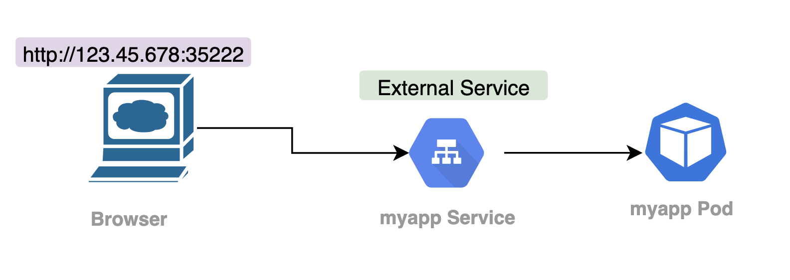

# External Service & Ingress   
  
**[Return to Main Page](../../README.md)**  
  
  
## Navigation  


1. [External Service](#External-Service)   
2. [Ingress](#Ingress)  
3. [Default Backend](#Default-Backend) 
4. [Map Hosts](#Map-Hosts) 
5. [Ingress Usecases](#Ingress-Usecases)  
6. [Configuring TLS Certificate](#Configuring-TLS-Certificate)

# External Service  
      

[Navigation](#Navigation)  
          
  
  
*note the flow*  

Setting an external service makes the pod accessible via port/url, this is good for quick test. For secure production you need to follow the [ingress](#Ingress) approach. 

- Defined as `type: loadBalancer` in service configuration  
- Required a `nodePort` to be defined  
- This is the port you put in the browser to access it 
- It has a range from (30000 to 32767)  

## Example External Service  

```yaml
---
apiVersion: v1
kind: Service
metadata:
  name: mongo-express-service
spec:
  selector:
    app: mongo-express
  type: LoadBalancer  
  ports:
    - protocol: TCP
      port: 8081
      targetPort: 8081
      nodePort: 30000  ---> entry 
```
  
Note when we run `kubectl get service` we have our loadbalancer with two IPs (internal/external)
  

```sh 
NAME                    TYPE           CLUSTER-IP    EXTERNAL-IP   PORT(S)          AGE
mongo-express-service   LoadBalancer   10.110.77.9   <pending>     8081:30000/TCP   10m
mongodb-service         ClusterIP      10.97.33.92   <none>        27017/TCP        62m
```


**Accesing your service** 
  
```
minikube service your-service-name
```  
    


## Ingress    
    
1. Create your ingress yaml
2. tie it up to internal service
3. create an `ingress implementation` which is an `ingress controller`  
4. Need to set up entry point, which varies based on cloud, bare metal etc. 
5. Create an ingress rule.  
  

    

*compare the flow with external service above* 
  

External Service looks like `user via browser --> service SVC balancer --> pod` .  
The URL will look like:  

`http://123.45.678:35222`  
  
Using Ingress will look like `browser --> ingress controller --> myapp-ingress --> internal service --> pod` 
The URL will look like:  

`https://my-lovely-app.com`  
  

## Example Ingress with http

```yaml  
apiVersion: networking.k8.io/v1beta1  
kind: ingress 
metadata:  
  name: myapp-ingress  
spec:  
  rules:  
  - host: myapp.com  
    http:
      paths:
      - backend:
          servicename: my-app-internal-service --------> maps to serice name
          serviceport: 8080    ------------------------> maps to service port
---  
apiversion: v1
kind: Service
metadata: 
  name: myapp-internal-service
spec:
  selector:
    app: myapp
  ports:
    - protocol:TCP
      port: 8080
      targetPort: 80 

```  
*bottom is internal service for comparison*  


- we define `kind: ingress`
- we define **rules** for routing.  
  - So the host `myapp.com` must be forwarded to an internal service `my-app-internal-service`   
  - path: is what comes after the url part i.e. `http://myapp.com/blah`    
  - http **does not** refer to the `http://myapp.com` , it's actually the second step reouting to internal service   
  - note service doesn't have :
    - node port
    - no load balancer on internal service  

**Important**  
  
- Must be `valid ip address`  
- You must map the domain name to `Node's entry ip address` which is the `entry point`  i.e. the hosting node.  
    
## Ingress controller  

Creating the yaml isn't enough, you need to create `ingress implementation` which is an `ingress controller`
  
- Evaluates all the rules
- Manages redirection
- Entrypont to cluster 
- Many 3rd party impmentations i.e. k8s Nginx Ingress controller 
    
**Entry point must be setup** be it external hardware, software, cloud etc.   
  
External request load balancing happens prior to entry point.
The ingress controller decides what to pass on to ingress service.  
  
### Ingress controller on minikube example  
  
`minikube addons enable ingress`

Automatically starts the k8s Nginx ingress controller. 

If we `kubectl get pod -n kube-system` we will see it added   
  
### Create ingress rule 

Let's create a ingress rule for our cluster (demo shows as dashboard app: will need to create my own)   
  
Set up yaml as shown above [sample](Example-Ingress-with-http)  
  
once executed with `kubectl apply -f ingress.yaml`  we wait for address to be populated:  
  
`kubectl get ingress -n [namespace] --watch` (will watch it)  
  
## Map Hosts
`sudo /etc/hosts` update the ip address accordingly.  
 
i.e  
 
```sh
##
# Host Database
#
# localhost is used to configure the loopback interface
# when the system is booting.  Do not change this entry.
##
127.0.0.1 localhost
255.255.255.255 broadcasthost
192.123.45.6    myapp.com   
 
```    
    
Ingress pod will now forward this rule to the ingress service.  
  
## Default Backend
`kubectl describe ingress myapp-ingress -n [namespace]`  
  
Note the `default-http-backend:80 (<none>)`  this is used if there is no rule/root to map to backend service.  
It's good for handling custom error messages.   
   

To set this up you need: 

- create internal service with same name `default-http-backend`  
- Port no

  
## Ingress Usecases
  
### Multiple paths for same host
  
```yaml  
apiVersion: networking.k8.io/v1beta1  
kind: ingress 
metadata:  
  name: simple-fanout-example 
  annotations: 
    nginx.ingress.kubernetes.io/rewrite-arget: /
spec:  
  rules:  
  - host: myapp.com  
    http:
      paths:
      - path: /analytics
        backend:
          servicename: analytics-service
          serviceport: 3000
      - path: /shopping
        backend:
          servicename: shopping-service
          serviceport: 8080    
```  
  
This gives two paths for two urls:  
`myapp.com/analytics-service`   -> analytics service -> analytics pod
and  
`myapp.com/shopping-service`    -> shopping service -> shopping pod  
  
### Multiple subdomains  
  

Instead of `http://myapp.com/analytics` we get `http://analytics.myapp.com`
  
I.e. analytics bit comes first.  
    
Instead of having one host and multiple paths, we have multiple hosts with one path.  
Each represents a subdomain.  
  

```yaml  
apiVersion: networking.k8.io/v1beta1  
kind: ingress 
metadata:  
  name: simple-fanout-example 
  annotations: 
    nginx.ingress.kubernetes.io/rewrite-arget: /
spec:  
  rules:  
  - host: analytics.myapp.com  
    http:
      paths:
        backend:
          servicename: analytics-service
          serviceport: 3000
  - host: shopping.myapp.com  
    http:
      paths:
        backend:
          servicename: shopping-service
          serviceport: 8080  
```    
  
## Configuring TLS Certificate
  
It's easy to configure https forwarding in ingress.    
Ensure you have the TLS certificate saved in the cluster as a secret.  
  
  
Just define the following above rules section under the spec.  

```yaml
  tls:
  - hosts:
    - myapp.com 
    secretName: myapp-secret-tls  
```
  
The secrets look like the following
  

```yaml
apiVersion: v1
kind: secret
metadata:
  name: myapp-secret-tls
  amespace: default
data:
  tls.crt: base64 encoded cert 
  tls.key: base64 encoded key
type: kubernetes.io/tls
```  
  
- Just base64 the value.
- data needs to be `tls.crt` and `tls.key`    
- Values have to be the file contents, not the path  
  
Remember to keep secret in the same namespace.   

  
  
  
**[Return to Main Page](../../README.md)**